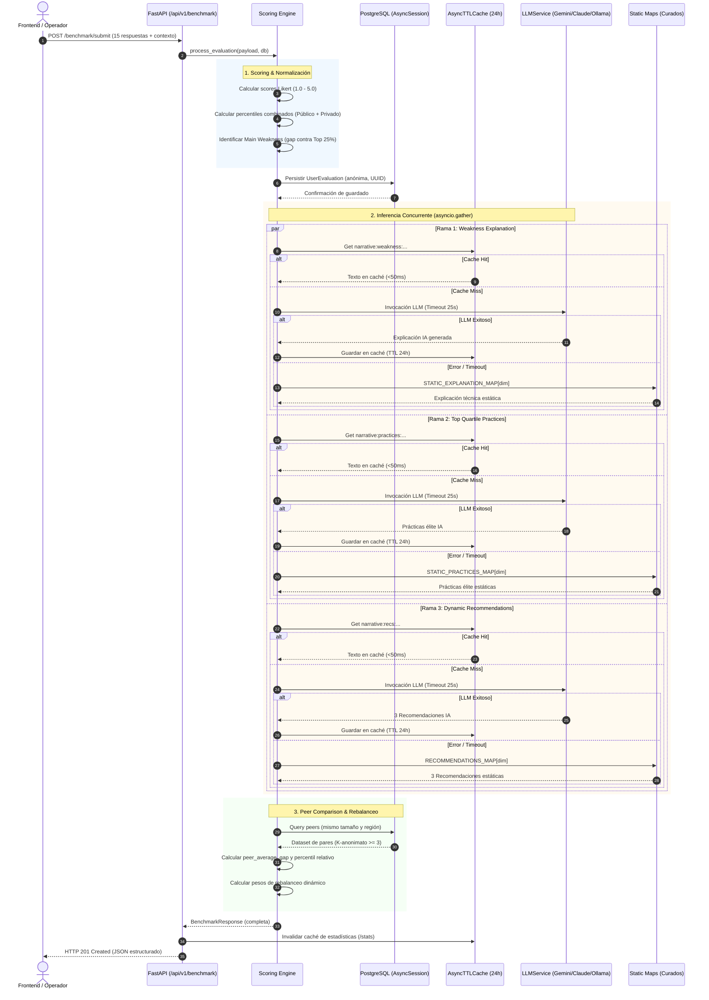
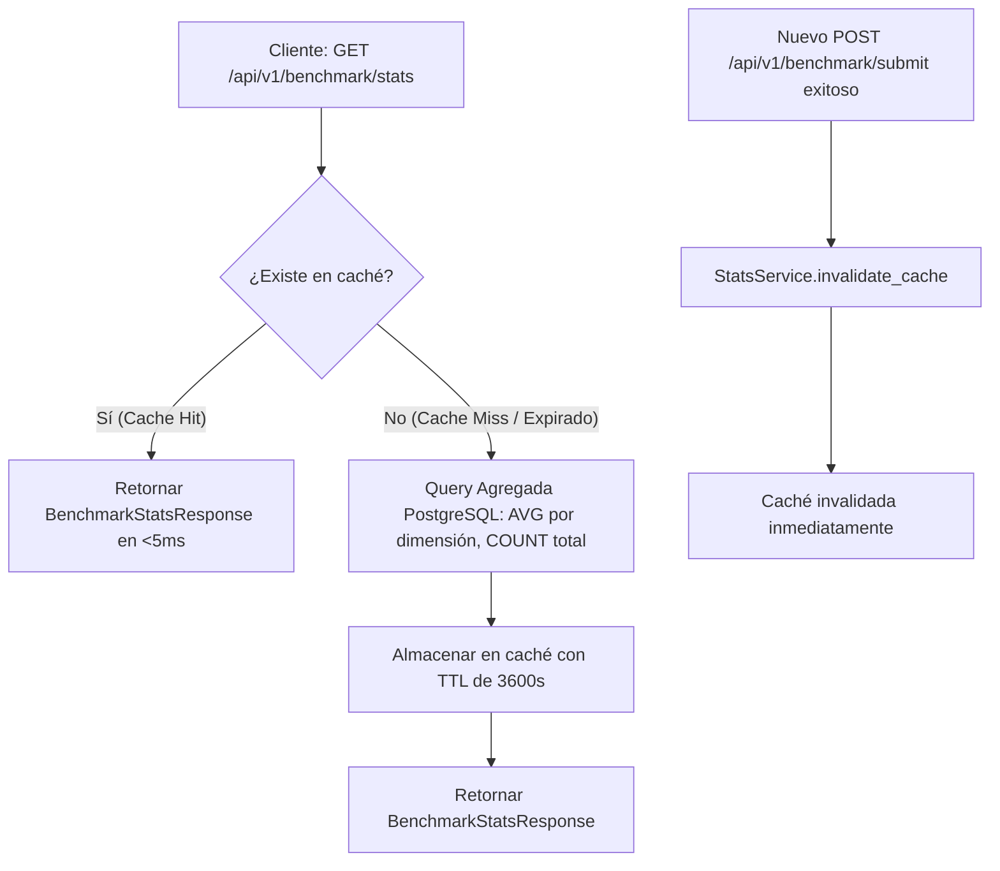
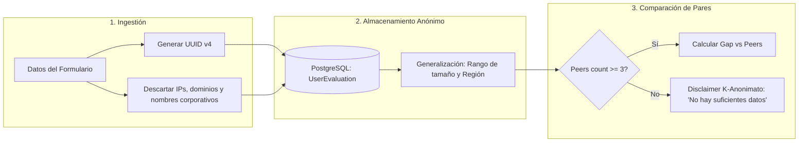

# 🏛️ Arquitectura del Sistema - Fase 2: Narrativas IA y Estadísticas Agregadas

Este documento detalla la arquitectura de extremo a extremo implementada en la **Fase 2** del motor **BENCHMARK·DC**, incluyendo el procesamiento concurrente de IA, la persistencia en PostgreSQL, la estrategia de caché reactiva y las garantías de privacidad.

---

## 1. 🔄 Ciclo de Vida Completo de una Evaluación (`POST /submit`)

---

## 2. 📊 Estadísticas de Plataforma e Invalidación Reactiva (`GET /stats`)

Para evitar consultas de agregación costosas en bases de datos con miles de registros, `StatsService` implementa una caché con **TTL de 1 hora** e **invalidación reactiva inmediata**:

---

## 3. 🛡️ Arquitectura de Privacidad por Diseño (Privacy by Design)

---

## 4. 🧩 Estructura Modular de Componentes

| Módulo | Responsabilidad Principal |
| :--- | :--- |
| `app/services/scoring_engine.py` | Cálculo de scores, percentiles, debilidad crítica, orquestación de `generate_ai_insights` (3 llamadas concurrentes) y peer comparison. |
| `app/services/llm_service.py` | Servicio centralizado agnóstico a proveedores con `AsyncTTLCache`, `SlidingWindowRateLimiter` y adaptadores (Gemini, Claude, Ollama). |
| `app/services/stats_service.py` | Agregaciones estadísticas de plataforma con caché en memoria de 1 hora e invalidación reactiva. |
| `app/core/rate_limiter.py` | Control de tasa basado en ventana deslizante con poda automática de timestamps para evitar fugas de memoria. |
| `app/core/cache.py` | Implementación asíncrona de caché en memoria con expiración por tiempo (TTL). |
| `app/schemas/benchmark_output.py` | Contratos Pydantic de salida (`BenchmarkResponse`, `NarrativesResponse`, `MainWeaknessEnriched`). |
| `app/schemas/benchmark_stats.py` | Contratos Pydantic de estadísticas agregadas (`BenchmarkStatsResponse`). |
