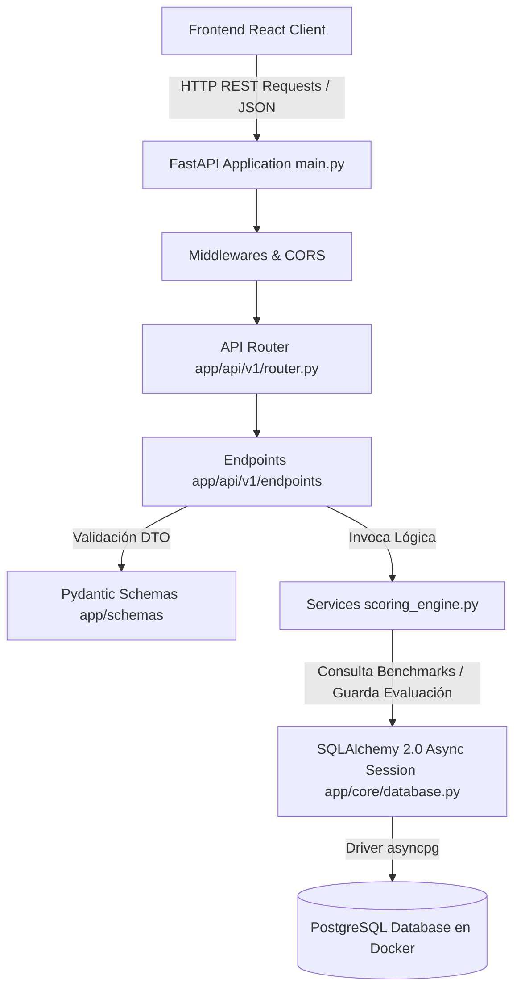

# 📘 Documentación Técnica de Arquitectura y Código: BENCHMARK·DC Engine

Este documento está diseñado como una guía técnica completa descargable para comprender, defender y explicar la arquitectura del backend del proyecto **BENCHMARK·DC Engine** a tus compañeros de equipo y líderes técnicos.

---

## 📄 Tabla de Contenidos
1. [Visión General del Proyecto](#1-visión-general-del-proyecto)
2. [Arquitectura del Sistema](#2-arquitectura-del-sistema)
3. [Análisis de Dependencias (requirements.txt)](#3-análisis-de-dependencias-requirementstxt)
4. [Estructura de Carpetas y Archivos](#4-estructura-de-carpetas-y-archivos)
5. [Explicación Detallada de los Fragmentos de Código](#5-explicación-detallada-de-los-fragmentos-de-código)
   - [Configuración Global y Base de Datos (app/core)](#-appcore)
   - [Modelos ORM de Base de Datos (app/models)](#-appmodels)
   - [Esquemas DTO / Pydantic (app/schemas)](#-appschemas)
   - [Capa de API y Rutas (app/api)](#-appapi)
   - [Servicio de Seeding de Datos (seed.py)](#-seedpy)
   - [Control de Migraciones (alembic/ & alembic.ini)](#-alembic)
   - [Contenedores y Entorno (docker-compose.yml & .env)](#-docker-composeyml--env)
6. [Resumen Guía para Explicar el Proyecto al Equipo](#6-resumen-guía-para-explicar-el-proyecto-al-equipo)

---

## 1. Visión General del Proyecto

**BENCHMARK·DC Engine** es un motor de evaluación comparativa (benchmarking) y recomendación para Data Centers (Centros de Cómputo / Infraestructura TI). 

### Objetivos Clave:
1. **Medición cuantitativa y cualitativa**: Evalúa 5 dimensiones clave del Data Center a través de un cuestionario de 15 preguntas con escala Likert (1 a 5).
2. **Comparación científica**: Compara el desempeño del usuario contra 35 benchmarks de referencia provenientes de **7 fuentes industriales y académicas de prestigio** (Uptime Institute, Google, Hyperscalers, FA-MAPPO, etc.).
3. **Análisis de percentiles y debilidades**: Calcula sub-scores por dimensión, identifica el percentil del centro de datos del usuario frente a la industria y detecta su principal cuello de botella.
4. **Recomendaciones automatizadas**: Genera sugerencias de optimización basadas en las desviaciones detectadas.

---

## 2. Arquitectura del Sistema

El backend sigue una **Arquitectura en Capas Asíncrona (Layered Architecture)** optimizada para FastAPI, SQLAlchemy 2.0 y PostgreSQL.



### Principios Fundamentales de la Arquitectura:
- **Asincronía Nativa (`async`/`await`)**: Todo el flujo de entrada/salida (I/O) hacia la base de datos utiliza operaciones no bloqueantes con `asyncpg` y `AsyncSession` de SQLAlchemy.
- **Separación de Responsabilidades**:
  - `schemas/`: Validan la estructura de entrada y salida (DTOs).
  - `models/`: Definen la estructura de la base de datos (ORM).
  - `services/`: Contienen el motor de cálculo y lógica pura del negocio.
  - `api/`: Exponen las rutas HTTP REST.
- **Privacidad y Anonimización por Diseño**: En `UserEvaluation`, las evaluaciones usan **UUID v4** en lugar de IDs auto-incrementables y registran únicamente la fecha (`Date`), nunca el timestamp exacto, previniendo rastreo por logs.

---

## 3. Análisis de Dependencias (`requirements.txt`)

A continuación se describe la función exacta de cada biblioteca listada en [requirements.txt](file:///c:/Users/lucas/VS/No-Country/S07-26-Team-21/backend/requirements.txt):

| Dependencia | Versión | Descripción y Propósito en el Proyecto |
| :--- | :--- | :--- |
| **`fastapi`** | `>=0.110.0` | Framework web moderno y de alto rendimiento en Python. Encargado de construir la API REST, inyección de dependencias y generación automática de documentación OpenAPI / Swagger. |
| **`uvicorn[standard]`** | `>=0.28.0` | Servidor web ASGI (Asynchronous Server Gateway Interface) ultrarrápido basado en `uvloop` y `httptools`. Se usa para levantar y correr la aplicación FastAPI en desarrollo y producción. |
| **`pydantic`** | `>=2.6.0` | Librería para validación de datos y manejo de tipos en Python usando anotaciones de tipo nativas. Garantiza que la información enviada por el Frontend cumpla las reglas de negocio (ej. Likert del 1 al 5). |
| **`pydantic-settings`** | `>=2.2.0` | Extensión de Pydantic para leer y validar variables de entorno desde archivos `.env` o el sistema de forma fuertemente tipada. |
| **`sqlalchemy`** | `>=2.0.28` | El ORM (Object-Relational Mapper) líder de Python. Utiliza la sintaxis moderna v2 (`Mapped`, `mapped_column`) y soporte nativo asíncrono para mapear clases Python a tablas SQL. |
| **`asyncpg`** | `>=0.29.0` | Driver / Cliente de conexión asíncrono a base de datos PostgreSQL de altísimo rendimiento escrito para `asyncio`. Permite a SQLAlchemy comunicarse con Postgres sin bloquear el hilo principal. |
| **`greenlet`** | `>=3.0.3` | Dependencia interna requerida por SQLAlchemy para gestionar context switching entre corrutinas cuando maneja mapeos y relaciones asíncronas. |
| **`pytest`** | `>=8.0.0` | Framework de pruebas automatizadas en Python. Permite escribir unit tests y integration tests. |
| **`pytest-asyncio`** | `>=0.23.0` | Plugin para `pytest` que habilita la ejecución de funciones de prueba asíncronas (`async def test_*`). |
| **`alembic`** | `>=1.19.0` | Herramienta oficial de migraciones de base de datos para SQLAlchemy. Permite evolucionar el esquema de la base de datos mediante versiones ordenadas sin perder datos. |

---

## 4. Estructura de Carpetas y Archivos

```text
backend/
├── alembic/                         # Configuración y scripts de migraciones de base de datos
│   ├── versions/                    # Histórico de migraciones SQL
│   │   └── 35131bf6e880_init_tables.py # Migración inicial de tablas (industry_benchmarks y user_evaluations)
│   ├── env.py                       # Contexto de ejecución de Alembic con SQLAlchemy
│   └── script.py.mako               # Plantilla para generar nuevas migraciones
├── app/                             # Código fuente principal de la aplicación FastAPI
│   ├── api/                         # Capa de transporte / Endpoints HTTP
│   │   └── v1/                      # Versión 1 de la API
│   │       ├── endpoints/           # Controladores agrupados por recurso
│   │       │   ├── benchmark.py     # Endpoints POST /submit y GET /results (en desarrollo)
│   │       │   └── health.py        # Endpoint GET /health de estado del servicio
│   │       └── router.py            # Enrutador principal de la v1
│   ├── core/                        # Núcleo del sistema: configuración y DB
│   │   ├── config.py                # Variables de configuración global (Pydantic BaseSettings)
│   │   └── database.py              # Motor Async Engine, SessionFactory y dep get_db()
│   ├── models/                      # Modelos ORM (Tablas de PostgreSQL)
│   │   ├── industry_benchmark.py    # Tabla 'industry_benchmarks' (constantes de referencia)
│   │   └── user_evaluation.py       # Tabla 'user_evaluations' (evaluaciones de usuarios)
│   ├── schemas/                     # Schemas Pydantic / DTOs (Contratos de API)
│   │   ├── benchmark_input.py       # Esquema de validación del payload enviado por el Frontend
│   │   └── benchmark_output.py      # Esquemas de respuesta para el Dashboard de resultados
│   ├── services/                    # Lógica de Negocio
│   │   └── scoring_engine.py        # Algoritmo de cálculo de promedios, percentiles y recomendaciones
│   └── main.py                      # Punto de entrada de la aplicación FastAPI
├── .env                             # Variables de entorno locales
├── .env.example                     # Plantilla de variables de entorno de referencia
├── alembic.ini                      # Archivo de configuración global de Alembic
├── docker-compose.yml               # Orquestación de PostgreSQL 15 en contenedor Docker
├── requirements.txt                 # Dependencias del proyecto Python
├── seed.py                          # Script de carga inicial de 35 benchmarks de referencia
└── SETUP-BACK.md                    # Guía rápida para levantar el proyecto localmente
```

---

## 5. Explicación Detallada de los Fragmentos de Código

### 📂 `app/core`

#### Archivo: `app/core/config.py`
Este archivo gestiona las variables de entorno centralizadas del proyecto.

```python
from pydantic_settings import BaseSettings, SettingsConfigDict

class Settings(BaseSettings):
    PROJECT_NAME: str = "BENCHMARK·DC Engine"
    API_V1_STR: str = "/api/v1"

    # Configuración de Base de Datos PostgreSQL
    POSTGRES_SERVER: str = "localhost"
    POSTGRES_PORT: int = 5433
    POSTGRES_USER: str = "postgres"
    POSTGRES_PASSWORD: str = "benchmark_password_2026"
    POSTGRES_DB: str = "benchmark_engine"

    @property
    def ASYNC_DATABASE_URL(self) -> str:
        """Genera la URL de conexión asíncrona usando asyncpg."""
        return (
            f"postgresql+asyncpg://{self.POSTGRES_USER}:{self.POSTGRES_PASSWORD}"
            f"@{self.POSTGRES_SERVER}:{self.POSTGRES_PORT}/{self.POSTGRES_DB}"
        )

    model_config = SettingsConfigDict(env_file=".env", case_sensitive=True)

settings = Settings()
```
- **¿Qué hace?**: Hereda de `BaseSettings`. Si existe un archivo `.env`, sobreescribe los valores por defecto automáticamente.
- **Detalle de `ASYNC_DATABASE_URL`**: Retorna el string de conexión con el protocolo `postgresql+asyncpg://`, informando a SQLAlchemy que use la librería asíncrona `asyncpg` para conectarse a Postgres en el puerto exponenciado `5433`.

---

#### Archivo: `app/core/database.py`
Configura el motor de base de datos asíncrono y las sesiones.

```python
from typing import AsyncGenerator
from sqlalchemy.ext.asyncio import AsyncSession, async_sessionmaker, create_async_engine
from sqlalchemy.orm import DeclarativeBase
from app.core.config import settings

# 1. Motor de conexión asíncrono
engine = create_async_engine(
    settings.ASYNC_DATABASE_URL,
    echo=False,
    future=True,
)

# 2. Fábrica de sesiones asíncronas
AsyncSessionLocal = async_sessionmaker(
    engine, class_=AsyncSession, expire_on_commit=False
)

# 3. Clase Base para modelos SQLAlchemy 2.0
class Base(DeclarativeBase):
    pass

# 4. Inyector de dependencia para FastAPI
async def get_db() -> AsyncGenerator[AsyncSession, None]:
    async with AsyncSessionLocal() as session:
        try:
            yield session
        finally:
            await session.close()
```
- **`create_async_engine`**: Crea el pool de conexiones asíncronas hacia PostgreSQL.
- **`AsyncSessionLocal`**: Es el creador de sesiones. `expire_on_commit=False` evita que los objetos cargados en memoria se invaliden tras un `commit()`, ideal en workflows asíncronos.
- **`get_db()`**: Función generadora para FastAPI (`Depends(get_db)`). Abre una sesión de DB por request HTTP y la cierra limpiamente al terminar en el bloque `finally`.

---

### 📂 `app/models`

#### Archivo: `app/models/industry_benchmark.py`
Representa la tabla `industry_benchmarks` donde residen las constantes científicas de comparación.

```python
class IndustryBenchmark(Base):
    __tablename__ = "industry_benchmarks"

    benchmark_id: Mapped[str] = mapped_column(String(100), primary_key=True)
    dimension: Mapped[str] = mapped_column(String(50), nullable=False, index=True)
    source_name: Mapped[str] = mapped_column(String(100), nullable=False)
    source_year: Mapped[int] = mapped_column(Integer, nullable=False, index=True)
    source_region: Mapped[str] = mapped_column(String(50), nullable=False, index=True)
    source_reliability: Mapped[float] = mapped_column(Float, nullable=False)

    # Nivel 1: Legacy / Malo
    level_1_description: Mapped[str] = mapped_column(Text, nullable=False)
    level_1_metric_value: Mapped[float] = mapped_column(Float, nullable=True)
    level_1_metric_unit: Mapped[str] = mapped_column(String(20), nullable=True)
    level_1_likert_equivalent: Mapped[int] = mapped_column(Integer, default=1)

    # Nivel 3: Promedio Industria
    level_3_description: Mapped[str] = mapped_column(Text, nullable=False)
    level_3_metric_value: Mapped[float] = mapped_column(Float, nullable=True)
    level_3_metric_unit: Mapped[str] = mapped_column(String(20), nullable=True)
    level_3_likert_equivalent: Mapped[int] = mapped_column(Integer, default=3)

    # Nivel 5: Élite / Best-in-Class
    level_5_description: Mapped[str] = mapped_column(Text, nullable=False)
    level_5_metric_value: Mapped[float] = mapped_column(Float, nullable=True)
    level_5_metric_unit: Mapped[str] = mapped_column(String(20), nullable=True)
    level_5_likert_equivalent: Mapped[int] = mapped_column(Integer, default=5)

    created_at: Mapped[datetime] = mapped_column(DateTime, server_default=func.now())
```
- **Propósito**: Guarda la escala de equivalencia (Nivel 1, Nivel 3, Nivel 5) para cada una de las métricas de la industria.
- **Uso de Índices (`index=True`)**: Los campos `dimension`, `source_year` y `source_region` están indizados para realizar consultas ultrarrápidas al calcular percentiles.

---

#### Archivo: `app/models/user_evaluation.py`
Representa la tabla `user_evaluations` donde se guardan las respuestas de cada usuario y sus resultados calculados.

```python
class UserEvaluation(Base):
    __tablename__ = "user_evaluations"

    # UUID v4: Garantiza identificadores únicos globales no adivinables
    evaluation_id: Mapped[uuid.UUID] = mapped_column(
        UUID(as_uuid=True), primary_key=True, default=uuid.uuid4
    )

    # Contexto de la instalación
    facility_size: Mapped[str] = mapped_column(String(20), nullable=False)
    facility_type: Mapped[str] = mapped_column(String(30), default="Enterprise")
    region: Mapped[str] = mapped_column(String(20), nullable=False)

    # Anonimización: Solo guarda fecha YYYY-MM-DD
    created_at: Mapped[date] = mapped_column(Date, default=date.today, nullable=False)

    # 15 Preguntas Likert (P1 a P15)
    p1_visibilidad_herramientas: Mapped[int] = mapped_column(Integer, nullable=False)
    ...
    p15_bloqueantes_expertise: Mapped[int] = mapped_column(Integer, nullable=False)

    # Sub-scores cacheados (Promedio 1 a 5 por dimensión)
    score_visibilidad: Mapped[float] = mapped_column(Float, nullable=True)
    score_friccion: Mapped[float] = mapped_column(Float, nullable=True)
    score_latencia: Mapped[float] = mapped_column(Float, nullable=True)
    score_auto_cuantificacion: Mapped[float] = mapped_column(Float, nullable=True)
    score_bloqueantes: Mapped[float] = mapped_column(Float, nullable=True)

    # Percentiles cacheados (0 a 100)
    percentile_visibilidad: Mapped[int] = mapped_column(Integer, nullable=True)
    percentile_friccion: Mapped[int] = mapped_column(Integer, nullable=True)
    percentile_latencia: Mapped[int] = mapped_column(Integer, nullable=True)
    percentile_auto_cuantificacion: Mapped[int] = mapped_column(Integer, nullable=True)
    percentile_bloqueantes: Mapped[int] = mapped_column(Integer, nullable=True)
    percentile_general: Mapped[int] = mapped_column(Integer, nullable=True)
```
- **Estrategia de Caché Interno**: Se persisten los sub-scores y percentiles directamente en la fila de la evaluación. Esto evita recalcular percentiles en cada lectura del Dashboard de resultados.

---

### 📂 `app/schemas`

#### Archivo: `app/schemas/benchmark_input.py`
Define la validación del JSON que envía el cliente React cuando el usuario completa el cuestionario.

```python
class BenchmarkSubmitSchema(BaseModel):
    facility_size: str = Field(..., description="Tamaño de la instalación")
    facility_type: str = Field(default="Enterprise", description="Tipo de centro de datos")
    region: str = Field(..., description="Región geográfica")

    # 15 preguntas con restricción estricta ge=1 (>=1) y le=5 (<=5)
    p1_visibilidad_herramientas: int = Field(..., ge=1, le=5)
    p2_visibilidad_dashboards: int = Field(..., ge=1, le=5)
    p3_visibilidad_telemetry: int = Field(..., ge=1, le=5)

    p4_friccion_energia: int = Field(..., ge=1, le=5)
    p5_friccion_cooling: int = Field(..., ge=1, le=5)

    p6_latencia_manual: int = Field(..., ge=1, le=5)
    p7_latencia_semi_auto: int = Field(..., ge=1, le=5)
    p8_latencia_full_auto: int = Field(..., ge=1, le=5)

    p9_auto_cuant_pue: int = Field(..., ge=1, le=5)
    p10_auto_cuant_utilizacion: int = Field(..., ge=1, le=5)

    p11_bloqueantes_staffing: int = Field(..., ge=1, le=5)
    p12_bloqueantes_supply: int = Field(..., ge=1, le=5)
    p13_bloqueantes_energy: int = Field(..., ge=1, le=5)
    p14_bloqueantes_regulacion: int = Field(..., ge=1, le=5)
    p15_bloqueantes_expertise: int = Field(..., ge=1, le=5)
```
- **Validación Automática**: Si el Frontend envía un valor menor a 1, mayor a 5 o de un tipo incorrecto (ej. un string `"cuatro"`), FastAPI/Pydantic devuelve un error `HTTP 422 Unprocessable Entity` automáticamente sin llegar a tocar la base de datos.

---

#### Archivo: `app/schemas/benchmark_output.py`
Estructura la respuesta enviada al Frontend para alimentar las gráficas y diagnósticos del Dashboard.

```python
class MainWeaknessSchema(BaseModel):
    dimension: str
    percentile: int
    user_score: float

class BenchmarkResultSchema(BaseModel):
    evaluation_id: UUID
    created_at: date
    user_context: Dict[str, str]
    scores_likert: Dict[str, float]
    percentiles: Dict[str, int]
    main_weakness: Optional[MainWeaknessSchema] = None
    recommendations: List[str] = []

class BenchmarkResponseCreatedSchema(BaseModel):
    evaluation_id: UUID
    message: str = "Evaluación procesada exitosamente"
```

---

### 📂 `app/api` y `app/main.py`

#### Archivo: `app/main.py`
Ensambla y arranca la aplicación FastAPI.

```python
from fastapi import FastAPI
from fastapi.middleware.cors import CORSMiddleware
from app.api.v1.router import api_router
from app.core.config import settings

app = FastAPI(
    title=settings.PROJECT_NAME,
    openapi_url=f"{settings.API_V1_STR}/openapi.json",
)

# CORS: Permite peticiones del Frontend React (Origins '*')
app.add_middleware(
    CORSMiddleware,
    allow_origins=["*"],
    allow_credentials=True,
    allow_methods=["*"],
    allow_headers=["*"],
)

# Incluir las rutas con prefijo /api/v1
app.include_router(api_router, prefix=settings.API_V1_STR)

@app.get("/")
async def root():
    return {"message": f"Bienvenido a {settings.PROJECT_NAME}", "docs": "/docs"}
```

---

#### Archivo: `app/api/v1/endpoints/health.py`
Endpoint simple de Health Check para verificar que la API está online.

```python
from fastapi import APIRouter

router = APIRouter()

@router.get("/health", tags=["System"])
async def health_check():
    return {"status": "ok", "service": "BENCHMARK·DC Engine API"}
```

---

### 📂 `seed.py`

El archivo `seed.py` es el cargador de datos maestros. Contiene **35 instancias** de `IndustryBenchmark` extraídas de publicaciones académicas e industriales de alto impacto.

Fragmento de carga y control de duplicados:

```python
import asyncio
from sqlalchemy.ext.asyncio import async_sessionmaker, create_async_engine
from sqlalchemy import select
from app.core.config import settings
from app.models.industry_benchmark import IndustryBenchmark

engine = create_async_engine(settings.ASYNC_DATABASE_URL, echo=False)
AsyncSessionLocal = async_sessionmaker(engine, expire_on_commit=False)

INITIAL_BENCHMARKS = [
    # 35 objetos IndustryBenchmark definidos detalladamente...
]

async def seed_data():
    print("🌱 Iniciando la carga de datos inicial (Seed)...")
    async with AsyncSessionLocal() as session:
        # Verificación idempotente para evitar duplicados
        result = await session.execute(select(IndustryBenchmark))
        existing_benchmarks = result.scalars().all()

        if existing_benchmarks:
            print(f"⚠️ La tabla 'industry_benchmarks' ya tiene {len(existing_benchmarks)} datos. Omitiendo el seed.")
            return

        session.add_all(INITIAL_BENCHMARKS)
        await session.commit()
        print(f"✅ ¡Éxito! Se insertaron {len(INITIAL_BENCHMARKS)} benchmarks en la base de datos.")

if __name__ == "__main__":
    asyncio.run(seed_data())
```
- **Idempotencia**: Al correr `python seed.py`, primero consulta si existen registros. Si ya hay data, aborta de forma segura evitando errores de clave primaria duplicada.

---

### 📂 `alembic`

#### Archivo: `alembic/env.py`
Es el script ejecutor de Alembic. Se modificó para integrarlo con la configuración de Pydantic y los modelos SQLAlchemy del proyecto:

```python
from app.core.config import settings
from app.models import Base

# Alembic lee los metadatos de nuestras clases Base
target_metadata = Base.metadata

# Asigna dinámicamente la URL del .env
config.set_main_option("sqlalchemy.url", str(settings.ASYNC_DATABASE_URL))
```
Gracias a esto, cuando ejecutas `alembic upgrade head`, Alembic lee directamente la configuración del `.env` y sabe conectarse al Postgres dentro del contenedor Docker sin duplicar contraseñas.

---

### 🐳 `docker-compose.yml` y `.env`

#### Archivo: `docker-compose.yml`
```yaml
version: '3.8'

services:
  db:
    image: postgres:15-alpine
    container_name: benchmark_postgres
    restart: always
    environment:
      - POSTGRES_USER=${POSTGRES_USER}
      - POSTGRES_PASSWORD=${POSTGRES_PASSWORD}
      - POSTGRES_DB=${POSTGRES_DB}
    ports:
      - "5433:5432"
    volumes:
      - postgres_data:/var/lib/postgresql/data

volumes:
  postgres_data:
```
- **Aislamiento**: Levanta un contenedor de PostgreSQL 15 liviano (`alpine`).
- **Mapeo de Puerto `5433:5432`**: Mapea el puerto `5432` interno del contenedor al puerto `5433` de la máquina host, previniendo conflictos si algún desarrollador del equipo ya tiene instalado un PostgreSQL nativo en su puerto `5432`.

---

## 6. Resumen Guía para Explicar el Proyecto al Equipo

Cuando presentes este proyecto a tus compañeros de equipo, puedes estructurar tu explicación en 4 puntos principales:

1. **"¿Por qué usamos esta pila tecnológica (FastAPI + SQLAlchemy 2.0 + asyncpg)?"**
   > *"Usamos un stack 100% asíncrono. FastAPI junto con `asyncpg` y `AsyncSession` de SQLAlchemy nos permite manejar cientos de solicitudes concurrentes con un consumo mínimo de RAM y CPU, evitando bloqueos I/O."*

2. **"¿Cómo se organiza el código y la arquitectura?"**
   > *"El proyecto sigue una separación clara de responsabilidades: los `models` definen las tablas de base de datos, los `schemas` de Pydantic validan estrictamente las entradas y salidas, la capa `services` ejecutará los cálculos estadísticos, y la capa `api` expone las rutas REST."*

3. **"¿Cómo cuidamos los datos y la privacidad?"**
   > *"Todas las evaluaciones usan identificadores únicos globales UUID v4 (no auto-incrementables) y sólo registramos la fecha del día (`created_at: Date`) sin timestamp exacto. Esto anonimiza los registros y previene la correlación por logs."*

4. **"¿Cómo se levanta el proyecto desde cero?"**
   > *"Con 4 comandos sencillos: levantamos la DB con `docker compose up -d`, instalamos dependencias con `pip install -r requirements.txt`, aplicamos las migraciones con `alembic upgrade head` y finalmente poblamos los 35 benchmarks de la industria con `python seed.py`."*

---

> 💡 **Nota**: Este documento se encuentra guardado en el archivo [`ARQUITECTURA_Y_CODIGO.md`](file:///c:/Users/lucas/VS/No-Country/S07-26-Team-21/backend/docs/ARQUITECTURA_Y_CODIGO.md) dentro de la carpeta `docs` para fácil acceso y descarga.
